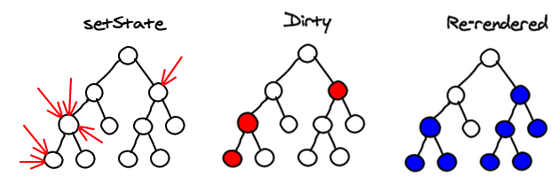
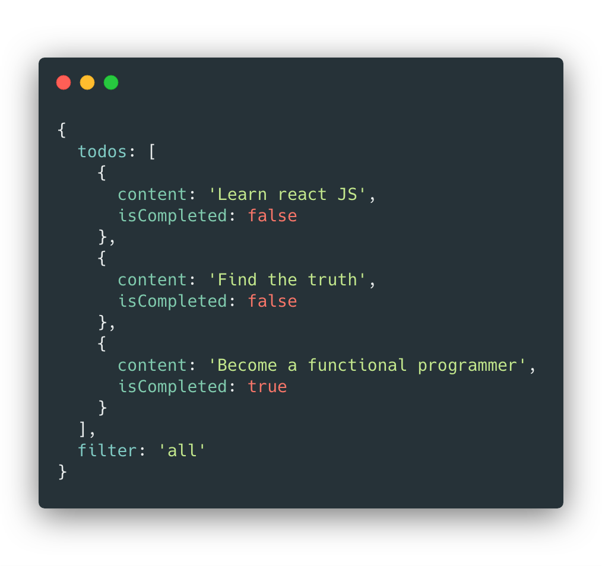
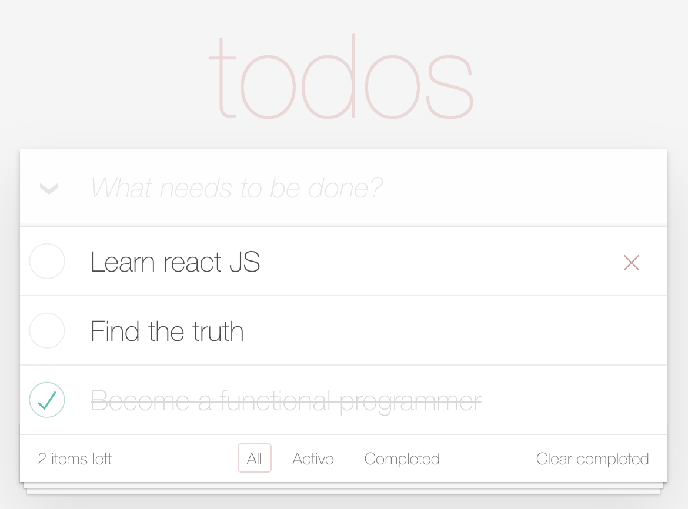
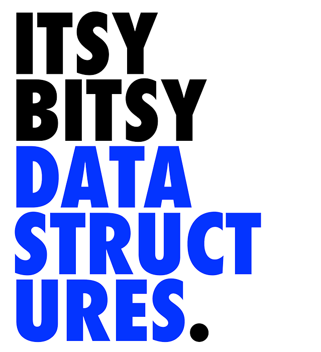

## React
### State reducer pattern

<p style="font-size:.7em">Slides: https://gvergnaud.github.io/react-state-reducer</p>


---

## 👋

**Gabriel Vergnaud**

Héticien de la P2017

<div class="flex">
  <span>Frontend engineer&nbsp;</span>
</div>

<div class="flex">
[@gvergnaud](https://github.com/gvergnaud)<span>&nbsp;on&nbsp;</span>
</div>

<div class="flex">
[@GabrielVergnaud](https://twitter.com/GabrielVergnaud)<span>&nbsp;on&nbsp;</span>
</div>

Note:
- Qui suis je ?
  - gabriel vergnaud
  - Heticien P2017
  - developer à Sketchfab.com (On recrute!)
  - gvergnaud on github
  - GabrielVergnaud on twitter

---


## 👀
<p class="fragment">Qui êtes vous ?</p>


Note:
- Qui etes vous ?
  - Techno utilisée ? 
  - quels projets ?
  - plutot agence / produits ?

---

## 🗺
<div style="display:flex; flex-direction: column; align-items: flex-start; width: 600px; margin: 0 auto;">
  <div class="flex">
    <h3 style="margin:0; margin-right:10px;">I.</h3>
    récapitulatif sur react
  </div>

  <div class="flex">
    <h3 style="margin:0; margin-right:10px;">II.</h3>
    state reducer pattern
  </div>

  <div class="flex">
    <h3 style="margin:0; margin-right:10px;">III.</h3>
    <span>exercice : cloner Notion&nbsp;</span>
  </div>
</div>

---

# I
Petit récapitulatif sur **React** ...

---

<h2 class="white">Un arbre</h2>
<h6 class="white lower">(de composants)</h6>

<!-- .slide: data-background="resources/tree.jpeg" -->

---



<p class="fragment">Chaque composant peut contenir un **state**</p>

Note:

- Recap sur react
  - une application react est un arbre de composants

          Component
           /      \
         /          \
    Component     Component
      /                \
    /                    \
Component              Component

---

### le state
<p class="fragment">la **data** qui défini l'interface</p>
<p class="fragment">Quand le state **update**, l'interface **update**</p>

Note:

  - Chaque component contiens un state
    - Le state est de la data qu'il peut muter au cours du temps
    - L'UI est défini par le state (view = f(state))

---
<div class="flex">
  
  
</div>

---

`view = f(state)`

plus besoin d'update la view.

Il suffit d'update le state

---

### Data flow

<p class="fragment">En react le data flow est **unidirectionnel**</p>

<p class="fragment">composant **parent** → composants **enfants**</p>

<p class="fragment">data **down**, events **up**</p>

Note:

  - Contrairement a d'autres framework ou les enfant peuvent directement updater leurs parents,
  en react le data flow est **unidirectionnel**. Il se dirige toujours du parent vers les enfants
  - a chaque fois qu'un component update son state, tous les components enfants sont re-render
    pour updater le DOM
  - Les props d'un component enfant est (presque) toujours le state d'un component parent.


---

<p class="white fragment">Cool.</p>
<!-- .slide: data-background="https://media.giphy.com/media/GCvktC0KFy9l6/giphy.gif" -->

---

Vous connaissez **useState()**

```jsx
function Counter() {
  const [count, setCount] = React.useState(0)

  return (
    <div>
      <p>{count}</p>
      <button onClick={() => setCount(x => x + 1)}>+</button>
    </div>
  )
}
```
<p class="fragment">C'est pratique</p>

Note:
- Vous avez appris `useState()` qui permet de déclarer un state updatable

---

Mais ça a des limitations

---


```js
const [isOpen, setIsOpen] = React.useState(false)
const [search, setSearch] = React.useState('')
const [sortBy, setSortBy] = React.useState('createdAt')
const [category, setCategory] = React.useState('all')
const [date, setDate] = React.useState('31')
// ...

const reset = () => {
  setIsOpen(false)
  setSearch('')
  setSortBy('createdAt')
  setCategory('all')
  setDate('31')
}
```
<p class="fragment">ça ne **scale** pas</p>

---

**le code se complexifie**

<small>les modifications de state peuvent provenir de n'importe où.</small>


**difficile à debugger**

<small>aucun moyen simple d'inspecter le code et ses updates au cours du temps.</small>


Note:

C'est cool, ça marche bien, mais, lorsque le component se complexifie, ça a des limitations
  - quand on a beaucoup de state
  - Dans une grande application on veut pouvoir refacto facilement, travailler à plusieur facilement et ajouter des fonctionnalité à notre projet sans complexifier le projet. cette version naive du state management est pratique pour les petit truc stateful isolé (genre un menu qui peut être ouvert ou fermé), mais est limité quand on veut construire quelque chose de complexe (comme notion!)

---


# II
State reducer pattern

---

Un nouveau hook

```js
const [state, dispatch] = useReducer(reducer, initialState)
```

---

<p class="white">Mais qu'est ce qu'un reducer ?</p>

<!-- .slide: data-background="https://media.giphy.com/media/7K3p2z8Hh9QOI/giphy.gif" -->


---

Un reducer est une function **pure**

de type `(A, B) => A`

Avec `A` et `B` des types variables.

Note:


- II. State reducer pattern
  - concept abstrait:
    - (a, b) => a
    - (state, action) => state


---


<p class="white fragment">C'est abstrait.</p>

<!-- .slide: data-background="https://media.giphy.com/media/pPhyAv5t9V8djyRFJH/giphy.gif" -->


---

Vous vous souvenez de `Array.reduce` ?


```js
const reducer = (sum, phrase) => sum + phrase.length

[
  'Hello',
  'Bonjour',
  'Hallo',
  'Buenos dias'
].reduce(reducer, 0)
```

<div class="fragment">
<p>ici le type **concret** est</p>

<p>`(number, string) => number`</p>
</div>


---

Dans le cas de notre application, le type concret sera

`(state, action) => state`


---

Une action ?

```js
const addOne = { type: 'ADD', value: 1 } // notre action

const reducer = (state, action) => {
  if (action.type === 'ADD') return state + action.value
  return state
}

reducer(10, addOne)
// => 11
```
<p class="fragment">juste de la **data**!</p>


---

**Les types**

<small>Des strings uniques qui permettent de communiquer l'intention de l'utilisateur au reducer.</small>

```js
const INCREMENT = 'INCREMENT'
const DECREMENT = 'DECREMENT'
```

Note:

- Le type des actions
    - souvent des string
    - permet au reducer de savoir de quel action il s'agit

---

<small>Les **actions** sont</small>

<p class="fragment">**Serialisable**</p>

<p class="fragment"><small>On peut envoyer une action via **HTTP** ou **WebSocket**</small></p>

<p class="fragment">**Transformable**</p>

<p class="fragment"><small>On peut **modifier** les actions à la volée avant de les envoyer au reducer</small></p>

<p class="fragment">**Inspectable**</p>

<p class="fragment"><small>On peut **logger** et **sauvegarder** le flux d'actions pour remonter dans le temps</small></p>

Note:

  - la forme des actions
    - leur caractéristique principale: c'est de la data! ca permet de:
      - serialiser les actions pour les envoyés sur un reseau (websocket, http, echange entre plusieurs process, electron...)
      - debugger facilement (DEMO redux devtools sur sketchfab)
        - inspecter les changement
        - undo et redo des changement
        - time travel debugging
    - les transformer à la volé grace à des **middlewares**
      - action
        -> |middleware| -> action modifiée
        -> |middleware| -> action remodifiée
        -> |reducer| -> state

---

<small>(Parenthèse)</small>

<small>en **TypeScript** on peut représenter nos actions comme un **type union**, ce qui permet de s'assurer que son code est **valide**</small>

<small>(pas d'action oubliée, pas d'erreur dans le nom d'un type)</small>

```ts
type Action =
  | { type: 'INCREMENT', value: number }
  | { type: 'DECREMENT', value: number }
```

Note:

faites pas trop attention à la syntaxe, si on a le temps et si ça vous interesse je vous ferais un petit cours de typescript en fin de semaine.

C'est de plus en plus utilisé, il y a 50% de la communité JS qui a switché sur TS en 2 ans.

Un truc a connaitre

---


### Structurer son state en modules

---

```js
// myStateModule.js

export const types = {/* ... */}

export const actions = {/* ... */}

export const selectors = {/* ... */}

export const initialState = {/* ... */}

export const reducer = (state, action) => {/* ... */}
```
<small>un module exporte des **types**, des **actions**, des **selectors**, un **initialState** et un **reducer**.</small>


---

```js

export const types = {
  INCREMENT: 'INCREMENT',
  DECREMENT: 'DECREMENT',
}

```

---

```js

export const actions = {
  increment: value => ({ type: types.INCREMENT, value }),
  decrement: value => ({ type: types.DECREMENT, value }),
}

```

---

```js
export const selectors = {
  count: (state) => state.count
}
```

le state doit être **minimal**. 

<small>Tout ce qui peut être **dérivé** du state doit être défini avec des selectors.</small>

Note:

- les selectors
  - l'idée c'est d'avoir le plus petit state possible. 
  - Des que quelque chose dans notre state peut être dérivé d'autre chose, alors il n'a plus sa place dans le state.
  - les selectors sont des functions qui permettent de dériver une valeur du state.
  - un peu comme les computed properties en vue.


---

```js

export const initialState = {
  count: 0
}

```

---

```js
export const reducer = (state, action) => {
  switch (action.type) {
    case types.INCREMENT:
      return { ...state, count: state.count + 1 }

    case types.DECREMENT:
      return { ...state, count: state.count - 1 }
  }
}
```

---
<h3 class="white">DEMO</h3>

<!-- .slide: data-background="https://media.giphy.com/media/3o7aCTfyhYawdOXcFW/giphy.gif" -->

---


Un state facile à faire **évoluer**

<small class="fragment">Toutes les modifications de state sont **au même endroit**.</small>
<small class="fragment">Que des fonctions pures implique un comportement **consistent** et **prévisible**.</small>
<small class="fragment">Le state **read-only**, accessible par des selecteurs, permet **refacto** sans casser l'API public.</small>
<small class="fragment">On peut ajouter des fonctionnalités sans augmenter la **complexité** du code.</small>

Note:
    
  - structurer son state grace au `state reducer pattern` permet de:
    - Avoir une application dont le comportement est prévisible et consistant. 
    - avoir toutes les modifications de state **au même endroit**.
    - ne pas pouvoir setter le state de manière arbitraire
    - lire le state seulement par des accesseurs
    - découpler l'UI de la gestion du state
  - Toutes ces caractéristiques rendent le code plus facile à faire évoluer, ajouter des features, refacto, etc tout en gardant une complexité basse.

---
<small>(Parenthèse)</small>

Qu'est ce que la **complexité** du code ?


---

En géométrie


<p class=fragment>deux formes simples</p>

---


<p class=fragment>Une forme complexe</p>


---

Comment évaluer si un bout de code est <br/>
complexe ou non ?

---

Comme en géométrie, une fonction est **complexe** si elle **fait plusieurs** choses **différentes**.

---

Pour garder un code maintenable il faut **décomposer** les fonctions complexes en petites fonctions simples.

---


<small class="fragment">(fin de la parenthèse)</small>

---

### State libraries


---

<small class=white>Redux permet de construire un **arbre de reducers**</small>


<small class=white>Grâce à **combineReducers()**</small>


<!-- .slide: data-background="resources/tree3-dark.jpg" -->

---

autre libs de state-management

- mobx
- vuex
- ...

Note:

  - vous avez peut être entendu parlé de redux ?
    - une lib de state management qui permet de **composer** plusieurs reducers les uns avec les autres pour avoir un **arbre de reducers**
            Reducer
            /      \
          /          \
        Reducer     Reducer
        /                \
      /                    \
  Reducer                 Reducer

    - ou mobx
    - ou vuex
    je les connais pas, mais ces plus ou moins la même chose.

---

### 👑
Ressources pour devenir un **roi** du **state**

---

<p class=white>Make impossible state impossible</p>
https://www.youtube.com/watch?v=IcgmSRJHu_8

<!-- .slide: data-background="resources/make-impossible-state-impossible.jpg" -->

Note:

- (Parenthese) Slide sur Make impossible state impossible
  - Les datastructures utilisées dans le state doivent être en accord avec ce qu'elle représente.
    - si vous avez pas le droit d'avoir deux fois le même élément dans une liste, utiliser un Set plutot qu'un Array
    - Si deux boolean sont mutuellement exclusifs, utiliser soit un boolean, soit un union de string
    - Si vous avez de la data qui correspond à un element, stockez par ID


---

<div class=flex>
  
  <div style="flex:1">
  <p><small>Know your **data structures**!</small></p>

  <p><small>**List** vs **Set** vs **Map** vs **Queue** vs **Stack** vs **Trees** vs **Graphs** vs **Binary Trees** ...</small></p>

  <p>https://github.com/jamiebuilds/itsy-bitsy-data-structures</p>
  </div>
</div>


---

### En résumé

---

Un state reducer est une **fonction**

<small>qui prend le **state précédent** et qui retourne le **state suivant**</small>

---

<small>Pour savoir comment modifier le state</small>
<br>
le reducer a besoin d'**une action**

---

Une action n'est que de la **donnée**

<small>Un objet qui **décrit** les changements à apporter au state</small>

---


<small>un module de state contient</small>
<br>
<p class=fragment>un **reducer**</p>
<p class=fragment>des **actions**</p>
<p class=fragment>des **selectors**</p>
<p class=fragment>des **types**</p>


---

<small>Ce pattern pert</small>
<p class=fragment>de réduire la **complexité** du code</p>
<p class=fragment>et d'**optimiser** le code pour le **changement**</p>


---

Dan abramov — Optimized for change

https://overreacted.io/optimized-for-change/

---

<small>Un code optimisé pour le changement est un code</small>
<br>
Sans relations **implicites** entre ses parties


Note:

  - ce pattern permet de réduire la complexité du code, et d'**optimiser le code pour le changement**
  - (Parenthese) La pire erreur qu'on peut faire en temps que developer c'est de croire que l'on sait comment le produit va évoluer. Les business requirement peuvent changer, votre produit peut pivoter... On ne peut pas deviner ce qu'il faudra changer dans le future. Il faut mettre cette incertitude au coeur de nos choix de design, et garder la plus grande flexibilité possible dans notre codebase.
  - [Dan abramov — Optimized for change](https://overreacted.io/optimized-for-change/)
  - Un code optimisé pour le changement === un code avec aucune relation implicite
  - distinction relation explicite vs relation implicite

---


### Merci

de votre attention


---

### Ressources

- [Make impossible state impossible, par Richard Feldman](https://www.youtube.com/watch?v=IcgmSRJHu_8)
- [Itsy Bitsy Data Structures, par @jamibuilds](https://github.com/jamiebuilds/itsy-bitsy-data-structures)
- [Dan abramov — Optimized for change](https://overreacted.io/optimized-for-change/)
---

**Gabriel Vergnaud**

- [Github](https://github.com/gvergnaud)
- [Twitter](https://twitter.com/GabrielVergnaud)
- [LinkedIn](https://www.linkedin.com/in/gabriel-vergnaud-09446199)

Note:
<!-- 
good gifs 
shipit: https://giphy.com/gifs/fail-code-boat-143vPc6b08locw
keyboard:
 - https://giphy.com/gifs/vodafone-de-done-keyboard-l378gxtNQaXcsqY7K
 - https://giphy.com/gifs/working-typing-cartoon-11BbGyhVmk4iLS
 - https://giphy.com/gifs/tmnt-teenage-mutant-ninja-turtles-cFdHXXm5GhJsc
 - https://media.giphy.com/media/3o7aCTfyhYawdOXcFW/giphy.gif
c pas sorcier 
- https://gfycat.com/fr/grandwearyflea
- https://giphy.com/gifs/cannabis-jamy-gourmaud-I9LxqeAcsBRNS
- https://www.google.com/imgres?imgurl=https%3A%2F%2Fresize-europe1.lanmedia.fr%2Fr%2F622%2C311%2Cforcex%2Ccenter-middle%2Fimg%2Fvar%2Feurope1%2Fstorage%2Fimages%2Feurope1%2Fmedias-tele%2Ffred-et-jamy-devoilent-le-nouveau-cest-pas-sorcier-1353712%2F21066760-1-fre-FR%2FFred-et-Jamy-devoilent-le-nouveau-C-est-pas-sorcier.jpg&imgrefurl=https%3A%2F%2Fwww.europe1.fr%2Fmedias-tele%2Ffred-et-jamy-devoilent-le-nouveau-cest-pas-sorcier-1353712&docid=XLVABVUvKIBgHM&tbnid=F-V_Lzs40s6APM%3A&vet=10ahUKEwjD4OWLl8biAhVC8uAKHcBuA0kQMwhRKAEwAQ..i&w=622&h=311&safe=off&bih=766&biw=1440&q=image%20jamie%20fred%20et%20jamy&ved=0ahUKEwjD4OWLl8biAhVC8uAKHcBuA0kQMwhRKAEwAQ&iact=mrc&uact=8 -->

<style>
  .flex {
    display: flex;
    align-items: center;
    justify-content: center;
  }
  .flex > *:not(:first-child) {
    margin-left: 10px
  }

  img.simple-image.simple-image {
    border:none;
    box-shadow:none;
    background: none;
  }

  .white.white.white {
    color: white;
    text-shadow: 0 2px 4px rgba(0,0,0, .5);
  }

  .lower.lower.lower {
    text-transform: none;
  }

  .reveal pre {
    border-radius: 5px;
    box-shadow: 0px 8px 25px rgba(0,0,0,.25);
  }

  .reveal section img {
    border: none;
      box-shadow: 0 5px 15px rgba(0, 0, 0, 0.15)
  }

  .reveal pre code {
    padding: 30px;
    border-radius: 5px;
    font-weight: normal;
  }

  .reveal code {
    font-weight: bold;
  }
</style>
